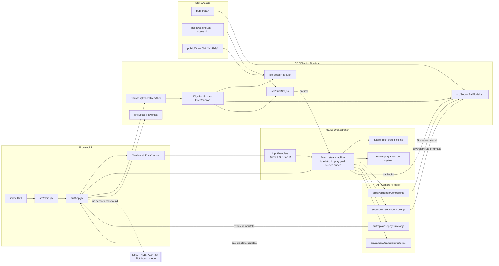

# Soccer 3D Architecture and Flow Chart

Last updated: 2026-02-22

## Repo map

Top-level and key subfolders from the current repository:

```text
soccer-3d/
|- docs/
|  |- ASSETS.md
|  |- architecture.md
|  |- status.md
|- public/
|  |- ball/
|  |  |- scene.gltf
|  |  |- scene.bin
|  |  |- textures/*
|  |- Grass001_2K-JPG/*
|  |- goalnet.gltf
|  |- scene.bin
|  |- manifest.json
|  |- robots.txt
|- src/
|  |- ai/
|  |  |- opponentController.js
|  |  |- goalkeeperController.js
|  |- camera/
|  |  |- CameraDirector.jsx
|  |- config/
|  |  |- gameConfig.js
|  |- replay/
|  |  |- ReplayDirector.js
|  |- ui/
|  |  |- MatchStoryPanel.jsx
|  |- App.jsx
|  |- main.jsx
|  |- SoccerBallModel.jsx
|  |- SoccerField.jsx
|  |- GoalNet.jsx
|  |- SoccerPlayer.jsx
|- index.html
|- package.json
|- vite.config.js
|- README.md
```

## Runtime stack summary

| Layer | Evidence | Notes |
|---|---|---|
| Build/dev server | `package.json`, `vite.config.js` | Vite (`vite`, `vite build`, `vite preview`). |
| UI runtime | `package.json`, `src/main.jsx`, `src/App.jsx` | React 19 single-page app mounted at `#root`. |
| 3D rendering | `package.json`, `src/App.jsx` | `@react-three/fiber` + `@react-three/drei` + `three`. |
| Physics | `package.json`, `src/App.jsx`, `src/SoccerBallModel.jsx`, `src/GoalNet.jsx`, `src/SoccerField.jsx` | `@react-three/cannon` world with ball/body/colliders/triggers. |
| AI | `src/ai/opponentController.js`, `src/ai/goalkeeperController.js`, `src/App.jsx` | In-memory controller updates on intervals. |
| Replay | `src/replay/ReplayDirector.js`, `src/App.jsx` | Frame buffer, replay arming/playback/cooldown. |
| Camera | `src/camera/CameraDirector.jsx`, `src/App.jsx` | Mode-based camera tracking and replay camera. |
| Persistence/API/auth | repo-wide search + required paths audit | Not found in repo. |

Required path audit:
- `README.md`: present
- `package.json`: present
- `next.config.*`: Not found in repo
- `tsconfig.*`: Not found in repo
- `prisma/schema.prisma`: Not found in repo
- main entrypoints from Next conventions (`app/`, `pages/`, `pages/api/`): Not found in repo
- deployment config (`Dockerfile`, `docker-compose`, `vercel.json`, `netlify.toml`): Not found in repo

## Route/request model

- Browser entrypoint is `index.html`, which loads `src/main.jsx`.
- `src/main.jsx` mounts `<App />` into `#root`.
- There is one runtime UI surface managed by `src/App.jsx`.
- No client HTTP request code was found (`fetch`, axios, websocket, etc. not found in `src/`).
- Request flow is therefore local browser -> React component tree -> in-memory game state and physics updates.

## Primary user journeys

1. Start match and enter active play
   - User clicks `Start Match` in `src/App.jsx`.
   - App transitions `idle -> intro -> in_play`, resets entities, then kicks off ball.
2. Control player/ball, pass, and shoot
   - Keyboard input handlers in `src/App.jsx` and `src/SoccerBallModel.jsx`.
   - Pass flow sets `passCommand` and transfers control to teammate.
   - Shoot flow charges with `D`, releases impulse and emits shot events.
3. Score goal and run replay
   - Goal trigger in `src/GoalNet.jsx` calls `onGoal`.
   - `src/App.jsx` updates score/momentum/timeline, arms replay, switches camera modes, resets ball after delay.
4. AI and keeper interaction
   - Opponent controller updates positions and can issue shot impulses.
   - Keeper controller can issue save/distribute velocity commands.

## End-to-end flow narrative

### 1) Browser boot and app initialization
1. `index.html` loads `/src/main.jsx`.
2. `src/main.jsx` renders `src/App.jsx` in React Strict Mode.
3. `src/App.jsx` creates game state, refs, replay director, AI states, and UI state.

### 2) Simulation loop and scene assembly
1. `src/App.jsx` renders:
   - Overlay/HUD controls and stats (`MatchStoryPanel`, score clock, controls).
   - `<Canvas>` and `<Physics>` world.
2. Scene composition includes:
   - `src/SoccerField.jsx` (field mesh + static boundaries)
   - `src/SoccerBallModel.jsx` (physics sphere, possession, shot/pass logic)
   - `src/GoalNet.jsx` (goal body + trigger collider)
   - `src/SoccerPlayer.jsx` (team players + keepers)
3. `src/camera/CameraDirector.jsx` applies mode-driven camera transforms every frame.

### 3) Input -> state -> physics path
1. `src/App.jsx` receives keyboard input for movement/sprint/pass/switch/replay skip.
2. `src/SoccerBallModel.jsx` receives keyboard input for shot charge/release and ball-mode movement.
3. App emits commands (`passCommand`, `externalBallCommand`) to ball model.
4. Ball model applies impulses/velocities through Cannon API and emits callbacks:
   - `onBallSnapshot`
   - `onPossessionChange`
   - `onShotEvent`
   - `onKickRelease`
5. App updates stats, timeline, camera mode, and replay buffer from those callbacks.

### 4) Goal and replay lifecycle
1. Ball enters goal trigger (`src/GoalNet.jsx`) and passes debounce/ball-body checks.
2. `onGoal` in `src/App.jsx`:
   - increments score
   - sets game state `goal_scored`
   - emits timeline event
   - updates momentum
   - arms replay (`ReplayDirector.armReplay`)
   - sets goal camera mode and visual pulses
3. Replay tick loop (`~33ms`) in `src/App.jsx`:
   - `ReplayDirector.update(nowMs)`
   - reads current replay frame
   - drives camera replay mode and replay HUD state
4. Ball reset timer returns game to `in_play` unless match already ended.

### 5) AI and keeper update loops
1. Opponent loop runs at `AI_CONFIG.UPDATE_INTERVAL_MS`:
   - calls `updateOpponentController(...)`
   - updates opponent player positions/rotations
   - can issue AI shot command to `SoccerBallModel`.
2. Keeper loop runs at `GOALKEEPER_CONFIG.UPDATE_INTERVAL_MS`:
   - calls `updateGoalkeeperController(...)`
   - updates keeper states
   - can issue save/distribute command to `SoccerBallModel`.

## High-level architecture diagram



## Sequence diagram (primary action)

Primary action chosen from app behavior: `Start Match -> Player shot -> Goal -> Replay`.


## Flow callouts required by audit

### Request flow (browser -> routes -> API -> DB/external)
- Browser boot path exists: `index.html` -> `src/main.jsx` -> `src/App.jsx`.
- API route layer: Not found in repo.
- Database layer: Not found in repo.
- External network request flow: Not found in repo.

### Auth flow
- Auth libraries or auth routes: Not found in repo.

### Data model flow (Prisma models -> queries/mutations)
- Prisma schema: Not found in repo.
- DB models/queries/mutations: Not found in repo.
- Runtime data model is in-memory React state and refs in `src/App.jsx` and component-local refs in `src/SoccerBallModel.jsx`.

### Background jobs / webhooks
- Job runner/queue/webhook handlers: Not found in repo.
- Only browser timers/intervals are used for local loop updates.

### Storage/media/email/third-party integrations
- Media/assets are local static files under `public/`.
- Third-party runtime packages are npm dependencies in `package.json`.
- SaaS integrations (email/storage providers/analytics SDKs): Not found in repo.

## Mermaid export

Attempted in this environment:
- `mmdc -V` -> command not recognized (`mmdc` is not installed).

Install and render:

```bash
npm i -D @mermaid-js/mermaid-cli
npx mmdc -i docs/architecture.md -o docs/architecture.png
```

If your renderer cannot parse markdown files directly, copy the primary architecture diagram into `docs/architecture.mmd` and run:

```bash
npx mmdc -i docs/architecture.mmd -o docs/architecture.png
```

Fallback `.mmd` content (primary diagram):


